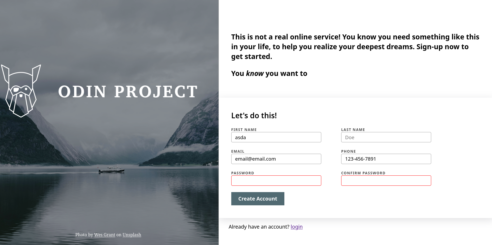

# Sign-Up Form Template

This is a simple sign-up form built with HTML, CSS. The focus of this project was to implement **form validation** using the built in features in HTML and CSS, and provide helpful user feedback during input.

## ✨ Features

- Custom form validation using HTML
- Visual feedback for valid and invalid inputs
- Styled using modern CSS
- Clear error messages for required fields
- Prevents submission until all fields meet validation criteria

## 🚫 Not Responsive

This version of the form is **not responsive**. It is designed for desktop viewing only. Responsive styles may be added in a future update.

## 🔧 Technologies Used

- **HTML5** – Structure of the form
- **CSS3** – Styling the layout and form elements

## 📋 Validation Rules
- First name and last name are required
- Email must be in a valid email format
- Password and confirm password must match
- Password requires a minimum length

## 🧠 Lessons Learned
- Gained hands-on experience building form validation from scratch
- Learned to use HTML built in validation format
- Learned to style form elements in CSS

## 📌 Future Improvements
- Make the form fully responsive for mobile and tablet
- Add accessibility features
- Integrate with a back-end for real form submissions

## 🙏 Credits
 This project is part of [The Odin Project](https://www.theodinproject.com/) curriculum. Special thanks to their amazing community and resources for guiding me through the process of building this game and enhancing my HTML and CSS skills!